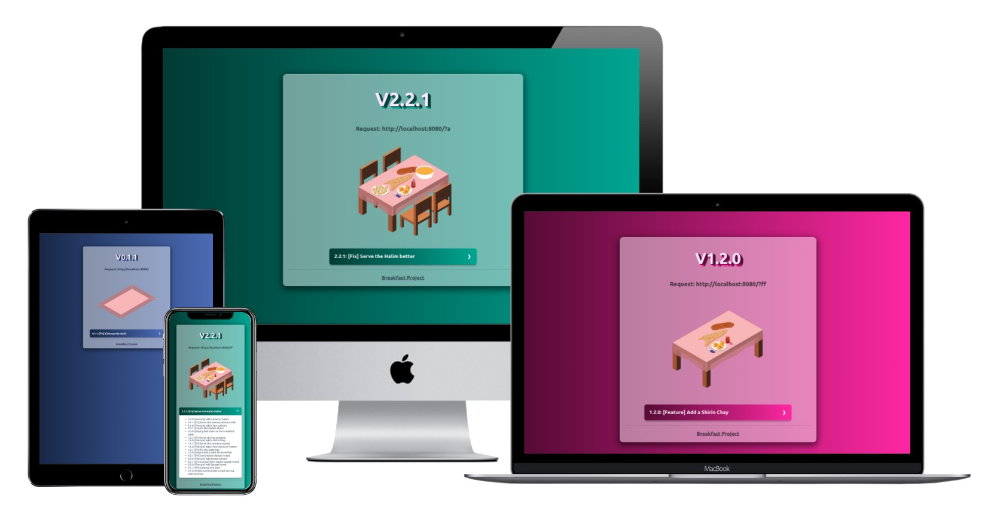
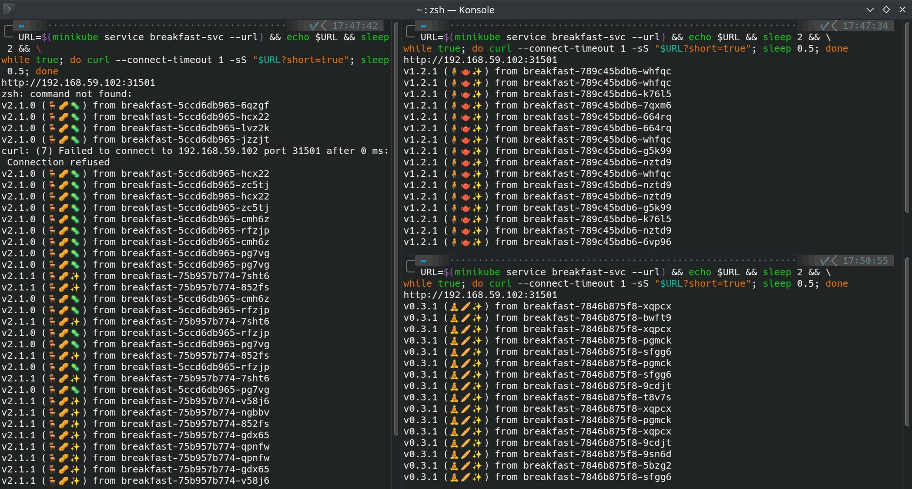
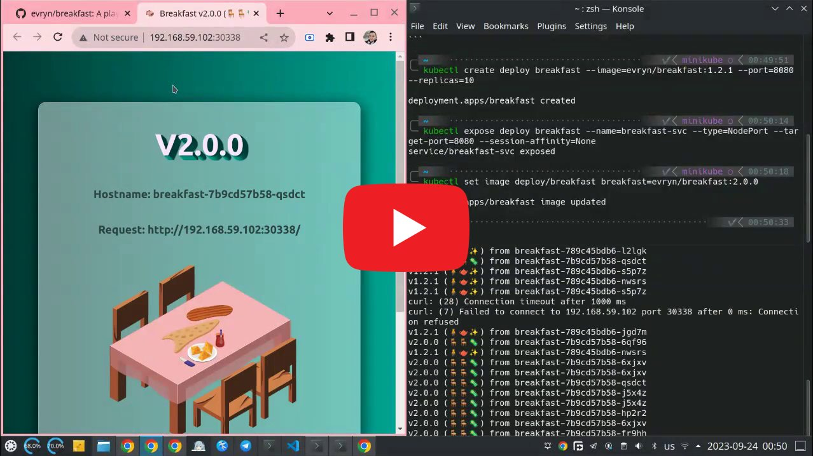
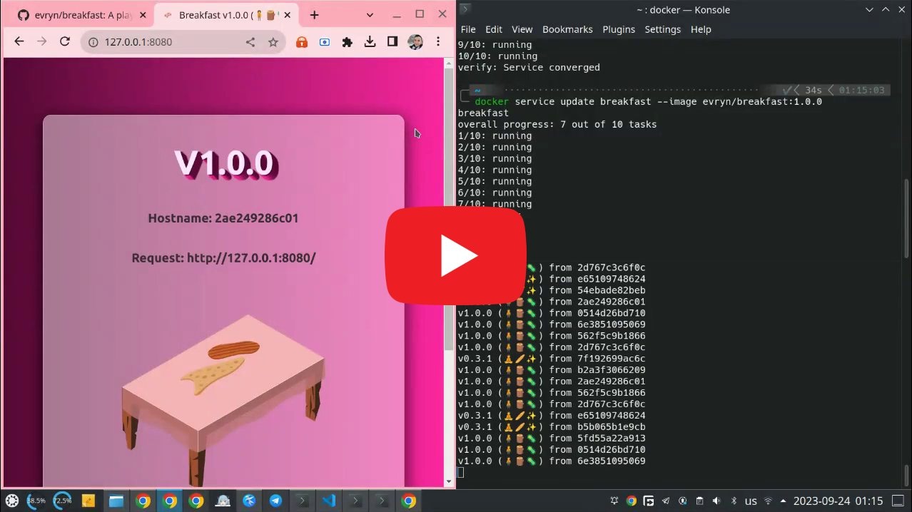

# 🍯 Breakfast

<p align="center">

</p>

## Introduction

Welcome to **🍯 Breakfast**! Ever wanted to explore the intricacies of GitOps workflows, or understand the nuances of deploying applications on platforms like Kubernetes and Docker Swarm? Dive into Breakfast and discover these tech realms through a delightful representation of an evolving Persian breakfast table.

Whether you're a DevOps enthusiast or someone simply intrigued by the vibrant world of deployments, the project offers a flavorful journey for all. You don't need to deploy `nginx:blah.blah.blah` anymore!

## Features

At the heart of 🍯 **Breakfast**, are two primary offerings, each designed to provide a unique user experience and cater to different preferences. Below are the standout features:

#### Browser-friendly Page
Send a request to `/` to get:

<p align="center">

</p>

- 🍽️ **Visual Breakfast Progress**: Experience the evolution of a Persian breakfast table, represented through dynamic visual stages. This is not just eye-catching, but it aligns closely with the varied deployment phases you'd encounter in real-world applications - either a major update, a feature addition or a bugfix.
- 🌐 **Ingress Host Display**: You can use different ingress options to direct the request to Breakfast. We'll show you how the final request got into the container.
- 📦 **Container Name Display**: Want to see which container handles the request during a deployment update? We'll show you the container name.


#### CLI-friendly Page:
Send a request to `/?short=true` to get:

<p align="center">

</p>

- 😋 **Emoji Representation**: Instead of the full-fledged visual representation, this shorter CLI variant uses delightful emojis to depict the breakfast stages. Good to visually distinct the versions during an update.
- 📦 **Container Name Display**: Just like the HTTP version, the shorter CLI response showcases the name of the container serving the request, offering an extra layer of information for the curious minds.


## Usage

Deploying and using Breakfast can be achieved in different environments. Here are step-by-step guides for Kubernetes and Docker Swarm.

### Deploying on Kubernetes

Deploying the Breakfast application on Kubernetes is straightforward. Follow the steps below to get it up and running in your cluster.

**Video Tutorial**: [Deploying Breakfast on Kubernetes
](https://www.youtube.com/watch?v=m9YgH5M5D-g)

<p align="center">
<a href="https://www.youtube.com/watch?v=m9YgH5M5D-g" target="_blank">
 
</a>
</p>

**Commands Used in the Video**:

```bash
# Create a Deployment object with 10 replicas
kubectl create deploy breakfast --image=evryn/breakfast:1.2.1 --port=8080 --replicas=10

# Expose it as a NodePort service
kubectl expose deploy breakfast --name=breakfast-svc --type=NodePort --target-port=8080
```

To get the service URL to view the Breakfast app in your browser or through the command line, use the following:

```bash
URL=$(minikube service breakfast-svc --url) && echo $URL && sleep 2 && \
while true; do curl --connect-timeout 1 -sS "$URL?short=true"; sleep 0.5; done
```

To observe changes in the deployed application, you can update the image version or other deployment settings:

```bash
kubectl set image deploy/breakfast breakfast=evryn/breakfast:2.0.0
```

### Deploying on Docker Swarm

If you're using Docker Swarm, the deployment process has its own set of commands. Here's how to deploy and access the Breakfast app:

**Video Tutorial**: [Deploying Breakfast on Docker Swarm
](https://www.youtube.com/watch?v=t8cyUOx7O5k)

<p align="center">
<a href="https://www.youtube.com/watch?v=t8cyUOx7O5k" target="_blank">
 
</a>
</p>

**Commands Used in the Video**:

```bash
# Deploy the service with 10 replicas
docker service create --name breakfast --replicas 10 --publish 8080:8080 evryn/breakfast:0.3.1
```

To access the Breakfast app, navigate to your node IP followed by the port `8080`. If you're on localhost, it's as simple as visiting `127.0.0.1:8080`. For a CLI version:

```bash
while true; do curl --connect-timeout 1 -sS "127.0.0.1:8080?short=true"; sleep 0.5; done
```

To make modifications to the currently deployed service, you can update the image or other service settings:

```bash
docker service update breakfast --image evryn/breakfast:1.0.0
```

## Customization

If you wish to tailor the Breakfast project according to your needs or simply want to play around with its content, the process is straightforward. Here's a step-by-step guide:

1. **Fork the Project**:
   Begin by forking the repository. This gives you your own copy to work with.

2. **Modify the Templates**:
   Navigate to the `templates` directory. The files in this directory use Go Template syntax. You can modify the content as per your requirements.

3. **Add Static Content**:
   If you have assets like images, CSS, or JavaScript that need to be served statically, place them in the `static` directory.

4. **Update Configuration**:
   Make changes to the `config.yaml` as needed.

   _Important: Ensure that you list versions in ascending order for proper registry tagging._

5. **Deployment Workflow**:
   A workflow is provided to build and upload the versioned images to [Docker Hub](https://hub.docker.com/), [Github Registry](https://ghcr.io), and [Quay.io](https://quay.io).
   For authentication and to ensure the correct credentials are used, check the `.github/workflows/build.yaml`. This workflow is triggered manually from your repository's Actions tab.

By following the steps above, everything should work seamlessly out-of-the-box. Enjoy customizing and deploying your own versions of Breakfast!

